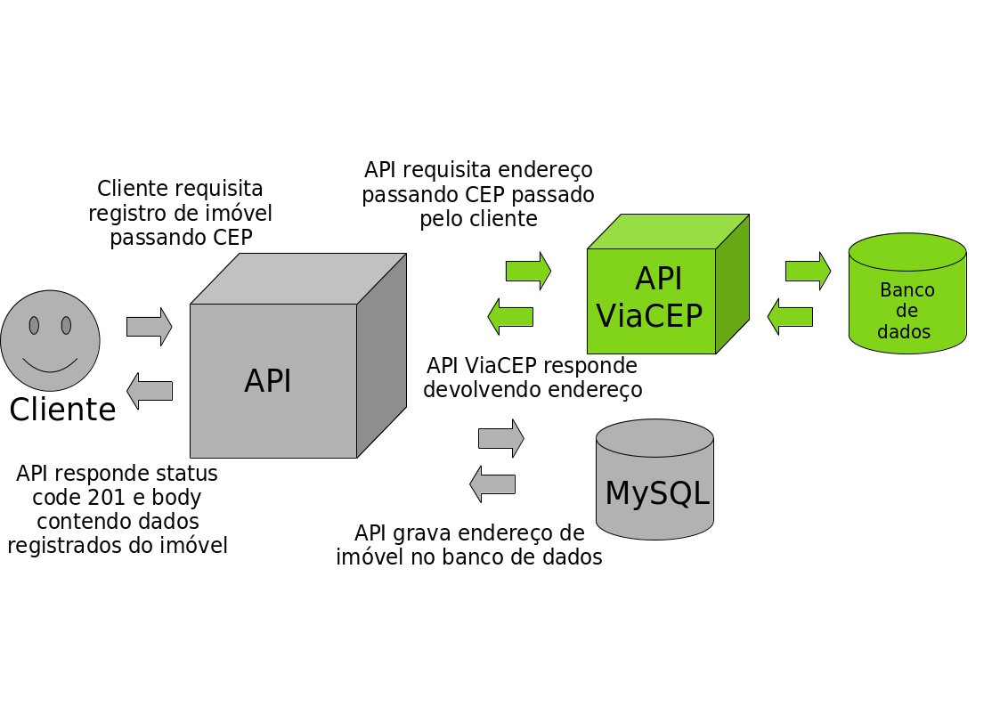
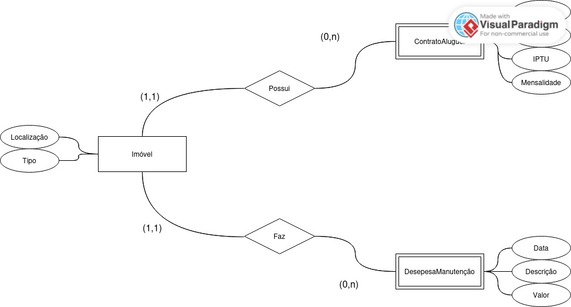
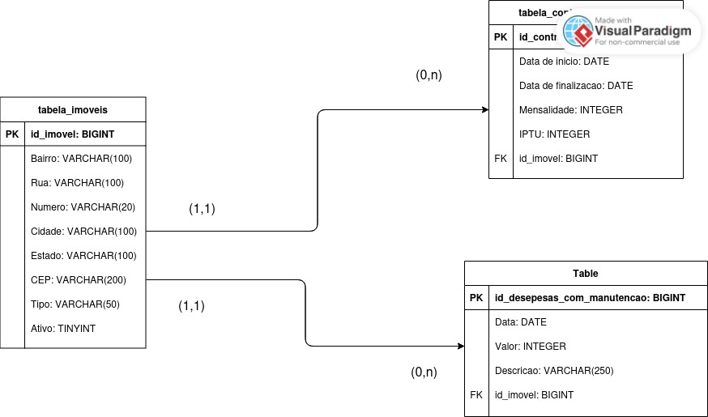

# Projeto de API de Sistema de Gerenciamento de Contrato de Aluguel de Imóveis

## Dados do projeto

- **Linguagem:** Java versão 17
- **Framework:** Spring Boot 3.3.4
- **Gerenciador de Dependências:** Maven
- **SGBD:** MySQL
- **API externa:** viacep

## Levantamento de requisitos

 Um escritório solicita um aplicação que auxilie no gerenciamento de contratos de alugueis de imóveis. O objetivo é que a aplicação seja capaz de cadastrar os imóveis que são gerenciados pelo escritório, administrar os contratos de aluguel e construir um registro de despesas provenientes de manutenção.
 
 Cada registro deve conter:
 
**(A) Imóvel**
- Tipo (informa se o imóvel é casa, apartamento, galpão, sala comercial ou terreno);
- Localização (informa bairro, rua, número, cidade e CEP).

**(B) Aluguel**
- Data de início;
- Data de finalização;
- Valor de mensalidade;
- Valor de IPTU.

**(C) Despesas**
- Data;
- Valor;
- Descrição.

 O escritório relata que o maior desafio que tem enfrentado ultimamente é a grande quantidade de imóveis registrados com erros nos dados de localização.
 
## Solução escolhida

- A solução escolhida será a utilização de uma API Rest que se conecta a um banco de dados para implementar a persistência de dados. 
- Para garantir a gestão de segurança da informação será implementado um sistema simplificado de autenticação e permissão de acesso utilizando token JWT.
- Notou-se que para solucionar o problema de dados registrados com erro somente a utilização de um sistema de validação seria insuficiente e foi decidido utilizar uma API externa que retorna dados de localização de um imóvel a partir de um CEP.

## Modelagem de Dados

A estrutura da aplicação gira em torno de 3 entidades:
- Imóvel: entidade forte que possuí atributo composto localização e atributo simples tipo;
- Contrato de Aluguel: entidade fraca que possui atributos data de início, date de finalização, valor de IPTU e valor de mensalidade;
- Despesas com Manutenção: entidade fraca que possui atributos data, descrição e valor.

A dinâmica das entidades gira em tordo de dois relacionamentos:
- Imóvel possui contrato de aluguel
- Imóvel faz despesa com manutenção

Cardinalidade mínima dos relacionamentos:
- A existência do imóvel não depende da existência de um contrato
- A existência do imóvel não depende da existência de uma despesa
- A existência do contrato depende da existência de um imóvel
- A existência da despesa depende da existência de um imóvel

Cardinalidade máxima dos relacionamentos:
- Um imóvel possui n contratos
- Um imóvel faz n despesas
- Um contrato só pode ser de um único imóvel
- Uma despesa só pode ser de um único imóvel

A construção do modelo lógico definiu que:
- Todas as entidades recebem uma chave primaria id;
- As entidades contrato de aluguel e despesas com manutenção recebem chave estrangeira id_imovel;
- O atributo composto localização da entidade imóvel foi dividido em 5 atributos bairro, rua, número, cidade e cep;

Apesar da regra de negócio impor que um imóvel não pode ter dois contratos diferentes em um mesmo intervalo de tempo, isso não impede a construção de um relacionamento de muitos para muitos entre as entidades imóvel e contrato de aluguel. Para atender esse demanda utiliza-se um serviço que verifica as datas de início e finalização do contrato no momento do cadastro do contrato de aluguel.

A modelagem de dados opta por não representar a entidade usuário. Essa decisão foi tomada porque essa entidade não se relaciona com nenhuma das três entidades do sistema de gerenciamento. Apesar da entidade não ser representada nos modelos conceitual e lógico, no modelo físico cria-se uma tabela que persiste os dados utilizados na autenticação no sistema de autenticação.

## Projeto de criação da aplicação

### 1. Criação do projeto Spring Boot

Nessa etapa cria-se o projeto Spring Boot, adiciona-se as dependências principais e configura-se a conexão com o banco de dados.

Ponteiros utilizados no arquivo src/main/resources/application.properties:
- ${DB_HOST}: Deve apontar para endereço IP do host e a porta onde o SGBD está rodando;
- ${DB_NAME}: Deve apontar para nome do banco de dados que foi criado no SGBD;
- ${DB_USER}: Deve apontar para login do usuário do SGBD;
- ${DB_PASSWORD}: Deve apontar para a senha do usuário do SGBD;
- ${JWT_SECRET}: Deve apontar para a secret key que foi criada para o token service.

Antes de inicializar a API, deve ser feita criação do banco de dados, usuário do SGBD e variáveis de ambiente.

Para testar os configurações do projeto, nessa etapa foi feita uma inserção no banco de dados. Apesar de no projeto já existir classes controller, model, DTO, service e repository (DAO), referentes a entidade imóveis, o sistema de cadastro de imóveis só será criado na próxima etapa do projeto. O foco dessa etapa é a criação do projeto Spring Boot, configuração de dependências principais e a conexão com o banco de dados. 

### 2. Criação do sistema de cadastro de imóveis

Nessa etapa cria-se o CRUD da entidade imóveis com regras de validação. Para a obtenção dos endereços utiliza-se uma API externa chamada viacep. A API externa viacep atua, de modo que, recebe um cep e devolve os dados do endereço. Por tanto, definiu-se que no método post do cadastro de imóveis seria passado somente o tipo do imóvel, o cep e o número. A partir daí, obtém-se os dados de bairro, rua, cidade e estado por meio da API externa. Vale ressaltar que para viabilizar a manipulação dos dados obtidos por meio da API externa necessita-se da utilização de biblioteca de serialização. A biblioteca de serialização tem a função de converter os dados obtidos por meio da API externa para um DTO java.

**(A) Método POST imóveis**

Parâmetros BodyRequest
- tipoImovel (EnumType.STRING)
- cep (String)
- numero (String)

O cep é utilizado como PathVariable na requisição enviada para a API externa.

Parâmetros BodyResponse
- id (Long)
- tipoImovel (EnumType.STRING)
- bairro (String)
- rua (String)
- numero (String)
- cidade (String)
- estado (String)
- cep (String)

Regras de validação
- **NotBlank:** cep e numero
- **NotNull:** tipoImovel
- **Regex:** cep (8 dígitos de número decimal)

**(B) Método GET imóveis**

PathVariable
- id (opcional)

Utilizando PathVariable chama o método detalhar (retorna objeto) e sem utilizar PathVariable chama método listar (retorna lista).

No método listar utiliza-se componente de paginação.

QueryParameters
- size (quantidade de itens por página)
- page (número da página)
- sort (ordenação)

Para facilitar as pesquisas, o parâmetro sort (ordenação) é definido por padrão com ordenação respectivamente por nome de bairro, rua e número.

Parâmetros BodyResponse
- id (Long)
- tipoImovel (EnumType.STRING)
- bairro (String)
- rua (String)
- numero (String)
- cidade (String)
- estado (String)
- cep (String)

**(C) Método PUT imóveis**

Parâmetros BodyRequest
- id (Long)
- tipoImovel (EnumType.STRING)
- bairro (String)
- rua (String)
- numero (String)
- cidade (String)
- estado (String)
- cep (String)

Regras de validação
- **NotNull:** id

Caso de parâmetros não passados no BodyRequest o atributo permanece inalterado. 

Parâmetros BodyResponse
- id (Long)
- tipoImovel (EnumType.STRING)
- bairro (String)
- rua (String)
- numero (String)
- cidade (String)
- estado (String)
- cep (String)

**(D) Método DELETE imóveis**

PathVariable
- id

O método delete implementa conceito de exclusão lógica por meio de atributo denominado ativo que recebe variável do tipo boolean. Além de ter a função de definir a exclusão da própria entidade imóvel, por meio de uma reação em cadeia, o atributo também tem a função de excluir as entidades dependentes da entidade imóvel, funcionando como algo semelhante a uma exclusão em cascata.

### 3. Criação do sistema de cadastro de contratos

Nessa etapa cria-se o CRUD da entidade contratos de aluguel com regras de validação.

**(A) Método POST contratos**

Parâmetros BodyRequest
- dataInicio (LocalDate "yyyy-MM-dd")
- dataFinalizacao (LocalDate "yyyy-MM-dd")
- mensalidade (Integer)
- iptu (Integer)
- idImovel (Long)

Parâmetros BodyResponse
- id (Long)
- dataInicio (LocalDate "yyyy-MM-dd")
- dataFinalizacao (LocalDate "yyyy-MM-dd")
- mensalidade (Integer)
- iptu (Integer)
- idImovel (Long)

Regras de validação
- **NotNull:** Todos atributos

**(B) Método GET contratos**

PathVariable
- id (opcional)

Utilizando PathVariable chama o método detalhar (retorna objeto) e sem utilizar PathVariable chama método listar (retorna lista).

No método listar utiliza-se componente de paginação.

QueryParameters
- size (quantidade de itens por página)
- page (número da página)
- sort (ordenação)

Para facilitar as pesquisas, o parâmetro sort (ordenação) é definido por padrão com ordenação respectivamente por data de inicio e data de finalização.

Parâmetros BodyResponse
- id (Long)
- dataInico (LocalDate "yyyy-MM-dd")
- dataFinalizacao (LocalDate "yyyy-MM-dd")
- mensalidade (Integer)
- iptu (Integer)
- idImovel (Long)

**(C) Método PUT contratos**

Parâmetros BodyRequest
- id (Long)
- dataInicio (LocalDate "yyyy-MM-dd")
- dataFinalizacao (LocalDate "yyyy-MM-dd")
- mensalidade (Integer)
- iptu (Integer)

Regras de validação
- **NotNull:** id

Caso de parâmetros não passados no BodyRequest o atributo permanece inalterado.

Parâmetros BodyResponse
- id (Long)
- dataInicio (LocalDate "yyyy-MM-dd")
- dataFinalizacao (LocalDate "yyyy-MM-dd")
- mensalidade (Integer)
- iptu (Integer)
- idImovel (Long)

### 4. Criação do sistema de cadastro de despesas

Nessa etapa cria-se o CRUD da entidade despesas de manutenção com regras de validação.

**(A) Método POST despesas**

Parâmetros BodyRequest
- data (LocalDate "yyyy-MM-dd")
- valor (Integer)
- descricao (String)
- idImovel (Long)

Parâmetros BodyResponse
- id (Long)
- data (LocalDate "yyyy-MM-dd")
- valor (Integer)
- descricao (String)
- idImovel (Long)

Regras de validação
- **NotNull:** data, valor, idImovel
- **NotBlank** descricao

**(B) Método GET despesas**

PathVariable
- id (opcional)

Utilizando PathVariable chama o método detalhar (retorna objeto) e sem utilizar PathVariable chama método listar (retorna lista).

No método listar utiliza-se componente de paginação.

QueryParameters
- size (quantidade de itens por página)
- page (número da página)
- sort (ordenação)

Parâmetros BodyResponse
- id (Long)
- data (LocalDate "yyyy-MM-dd")
- valor (Integer)
- descricao (String)
- idImovel (Long)

**(C) Método PUT despesas**

Parâmetros BodyRequest
- id (Long)
- data (LocalDate "yyyy-MM-dd")
- valor (Integer)
- descricao (String)
- idImovel (Long)

Regras de validação
- **NotNull:** id

Caso de parâmetros não passados no BodyRequest o atributo permanece inalterado.

Parâmetros BodyResponse
- id (Long)
- data (LocalDate "yyyy-MM-dd")
- valor (Integer)
- descricao (String)
- idImovel (Long)

### 5. Padronização de retornos

**(A) Confirmação**
- **204 No Content:** DELETE;
- **200 ok:** PUT, GET;
- **201 created:** POST.

No método POST o cabeçalho da resposta devolve url de acesso ao detalhamento do objeto criado.

**(B) Erro no servidor**
Para erros do servidor utiliza-se o retorno padrão do spring boot, fazendo somente uma configuração para que a stacktrace do erro não seja retornada no corpo da resposta. Essa configuração evita a exposição de informações desnecessariamente.

**(C) Erro do cliente**
Pra que não fosse feita uma configuração de tratamento de erros diferente para cada método, o tratamento desse tipo de erro foi feito em uma classe que trata erro por tipo de exceção.

- **404 Not found:** EntityNotFoundException
- **400 Bad request:** MethodArgumentNotValidException

### 6. Autenticação

 Nessa etapa, inicialmente, cria-se a classe CorsConfiguration para determinar as configurações de liberação de permissões para que o front-end tenha autorização para consumir a aplicação.
 
 Ponteiro utilizado no arquivo src/main/resources/application.properties:
 - ${FRONT_END_HOST}: Deve apontar para endereço IP do host e a porta onde o front-end está rodando.
 
 Essa etapa consiste na implementação de dependência do spring boot voltada para a área de segurança e configuração de sistema de autenticação stateless.
 
 Além das configurações de segurança é implementado uma entidade que fica responsável por registrar os logins e senhas dos usuários.
 
 Vale ressaltar que o sistema implementa somente um endpoint contendo sistema de login. O sistema de login é configurado para recuperar senha criptografada por algoritmo de hashing do tipo Bcrypt. Isso implica dizer que além da criação do usuário ser responsabilidade do administrador do banco de dados, o mesmo deve criar senha criptografada por algoritmo de hashing do tipo Bcrypt para o registro ser compatível com o sistema.
 
 Além de mudar a configuração do tipo de autenticação para stateless, na classe SecurityConfigurations também foi desabilitada a proteção contra ataques do tipo CSRF (Cross-Site Request Forgery). Essa configuração foi feita porque ao trabalhar com autenticação via token o próprio token é uma proteção contra esses tipos de ataque.
 
 Apesar de ter sido criada uma classe que se chama AutenticacaoService responsável por determinar os parâmetros de login, o endpoint de login utiliza a classe AuthenticationManager, que já é implementada pelo próprio spring boot. Na prática a classe AuthenticationManager utiliza em  background a classe AutenticacaoService.
 
### 7. Geração do token

 Essa etapa consiste na implementação de um sistema de geração de token jwt utilizando biblioteca externa. A geração do token é feita após a autenticação com o objetivo de entregar ao usuário uma credencial de identificação. A configuração define tempo de expiração de token de 2 horas.

 Na classe TokenService foi definida uma secret key que depende da criação de variável de ambiente:
 - ${JWT_SECRET}: Deve apontar para uma secret key definida pelo administrador.
 
 Configurações de token:
 - **Algoritmo de decodificação:** HMAC256;
 - **Issuer:** "API Sistema de Gerenciamento de Contrato de Aluguel de Imóveis";
 - **Subject:** login de usuário;
 - **Tempo de expiração:** 2 horas.
 
### 8. Controle de acesso

 Essa etapa consiste na configuração das regras de controle de acesso. Para a configuração das regras de controle de acesso, além das configurações feitas na classe SecurityConfigurations, utiliza-se um componente adicional SecurityFilter que herda da classe OncePerRequestFilter do springboot. A classe SecurityFilter tem o papel de barrar as requisições que não possuem um token jwt válido no cabeçalho da requisição.
 
 Configurações de controle de acesso:
 - **permissão de acesso sem autenticação:** POST "/login"
 - **permissão de acesso somente com autenticação:** todos os métodos de "/imoveis", "/despesas" e "contratos"

 
 
 
 

 
 
 
 
